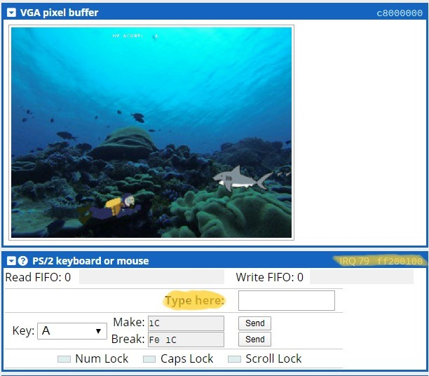

# VGA-Runner
Infinite Runner Game on VGA \
Made by: Edwin Zhang, Malhar Shah \

## How to run:
Run on: https://cpulator.01xz.net/?sys=arm-de1soc&d_audio=48000 
1) Once on cpulator, change the mode to C and deleted any default code 
2) Copy everything in main.c and paste it in the editor. 
3) Press compile and press continue 
4) It is recommended to drag the input ps/2 input tab with address **ff200100** to an orientation similar to the image below 

5) WASD to move the player and avoid the sharks!\
**Note CPUlator does not support multiple files. Only main.c is needed**
